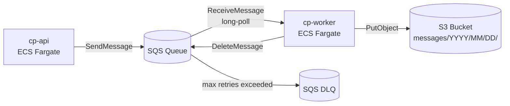
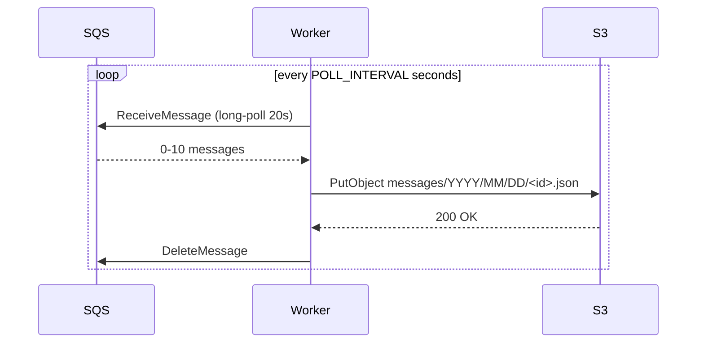
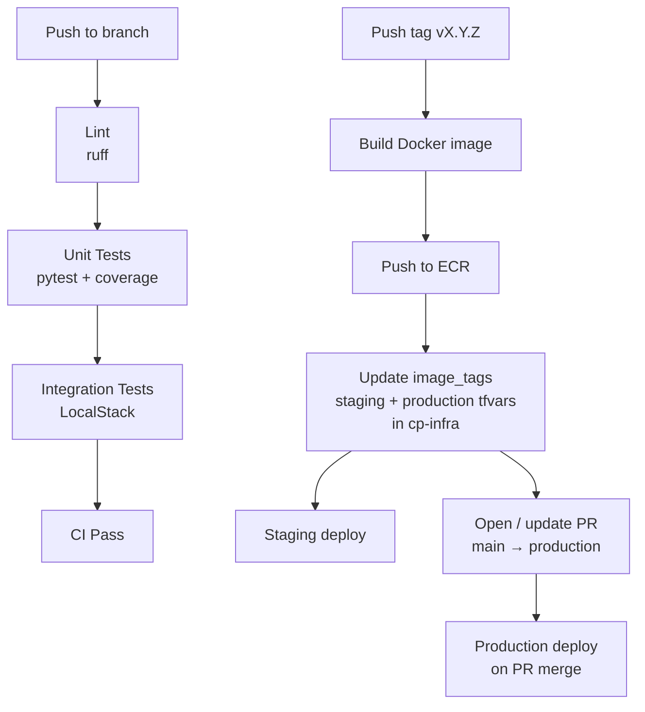

# cp-worker


SQS consumer microservice — polls an SQS queue on a configurable interval, uploads each message as a JSON object to S3, then deletes it from the queue.

> Infrastructure, local stack, and CI/CD orchestration live in [`cp-infra`](https://github.com/cp-koss110/cp-infra).

---

## Architecture



---

## Message flow



---

## S3 key format

```
messages/YYYY/MM/DD/<sqs-message-id>.json
```

Each file is enriched with processing metadata:
```json
{
  "message_id": "...",
  "email_subject": "...",
  "email_sender": "...",
  "email_timestream": "...",
  "email_content": "...",
  "_worker_metadata": {
    "processed_at": "2026-03-27T10:00:00+00:00",
    "s3_key": "messages/2026/03/27/<id>.json",
    "worker_version": "v1.0.2"
  }
}
```

---

## Local development

The full local stack (LocalStack + cp-api + cp-worker) is managed from [`cp-infra`](https://github.com/cp-koss110/cp-infra). Clone all three repos as siblings:

```
parent-dir/
├── cp-infra/
├── cp-api/
└── cp-worker/   ← this repo
```

```bash
cd cp-infra

# Start LocalStack and seed AWS resources
make local-up

# Build images and start the full stack
make local-build

# Follow worker logs
make logs-worker

# Verify messages landed in S3
aws --endpoint-url=http://localhost:4566 --region us-east-2 \
  s3 ls s3://exam-costa-local-messages/messages/ --recursive

# Tear down
make local-down
```

---

## Make targets

| Target | Description |
|--------|-------------|
| `make install` | Create `.venv` and install all dependencies |
| `make test` | Run unit tests (alias for `test-unit`) |
| `make test-unit` | Unit tests with mocked AWS — fast, no dependencies |
| `make test-integration` | Integration tests against LocalStack — requires `LOCALSTACK_ENDPOINT` |
| `make lint` | Run ruff linter |
| `make pre-commit-install` | Install pre-commit git hooks |
| `make pre-commit-run` | Run all pre-commit hooks against all files |
| `make venv-clean` | Remove `.venv` |

### Running integration tests

```bash
# Start LocalStack first (from cp-infra)
cd ../cp-infra && make local-up

# Then run
cd ../cp-worker
LOCALSTACK_ENDPOINT=http://localhost:4566 make test-integration
```

---

## Pre-commit hooks

Runs on every commit in this repo:

| Hook | What it checks |
|------|---------------|
| `trailing-whitespace` | No trailing whitespace |
| `end-of-file-fixer` | Files end with a newline |
| `check-yaml` | Valid YAML syntax |
| `check-merge-conflict` | No leftover conflict markers |
| `check-added-large-files` | No files > 500 KB |
| `ruff` | Python lint |
| `ruff-format` | Python formatting |
| `detect-secrets` | No hardcoded credentials |
| `unit tests (fast)` | Unit tests run on every Python file commit |

**Setup:**
```bash
make pre-commit-install
```

**Run manually:**
```bash
make pre-commit-run
```

---

## CI/CD



### Deploying a specific tag

```bash
# Via GitHub CLI — redeploy an existing tag without rebuilding
gh workflow run release.yml \
  --repo koss110/cp-worker \
  --field image_tag=v1.0.2 \
  --field open_pr=true
```

---

## Environment variables

| Variable | Default | Description |
|----------|---------|-------------|
| `AWS_REGION` | `us-east-2` | AWS region |
| `SQS_QUEUE_URL` | — | SQS queue URL to poll |
| `S3_BUCKET_NAME` | — | S3 bucket to upload messages to |
| `POLL_INTERVAL` | `5` | Seconds to sleep when queue is empty |
| `MAX_MESSAGES_PER_POLL` | `10` | Max messages per ReceiveMessage call |
| `SQS_VISIBILITY_TIMEOUT` | `30` | Seconds message is hidden after receive |
| `SQS_WAIT_TIME_SECONDS` | `20` | Long-polling wait time |
| `LOCALSTACK_ENDPOINT` | — | Set to use LocalStack instead of AWS |
| `LOG_LEVEL` | `INFO` | Log level |
| `APP_VERSION` | `unknown` | Injected at build time via `--build-arg VERSION` |
