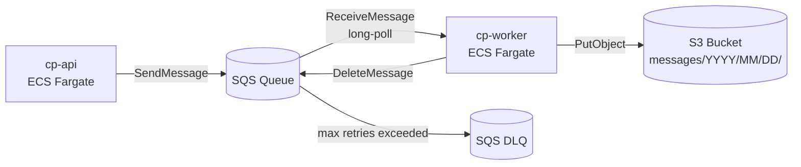
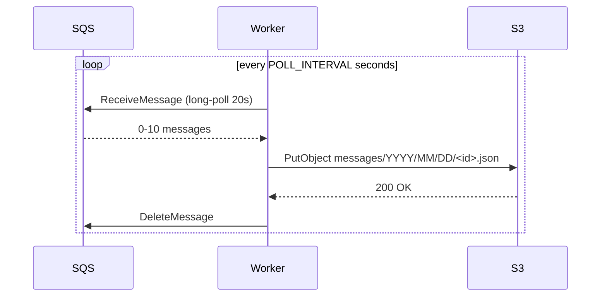
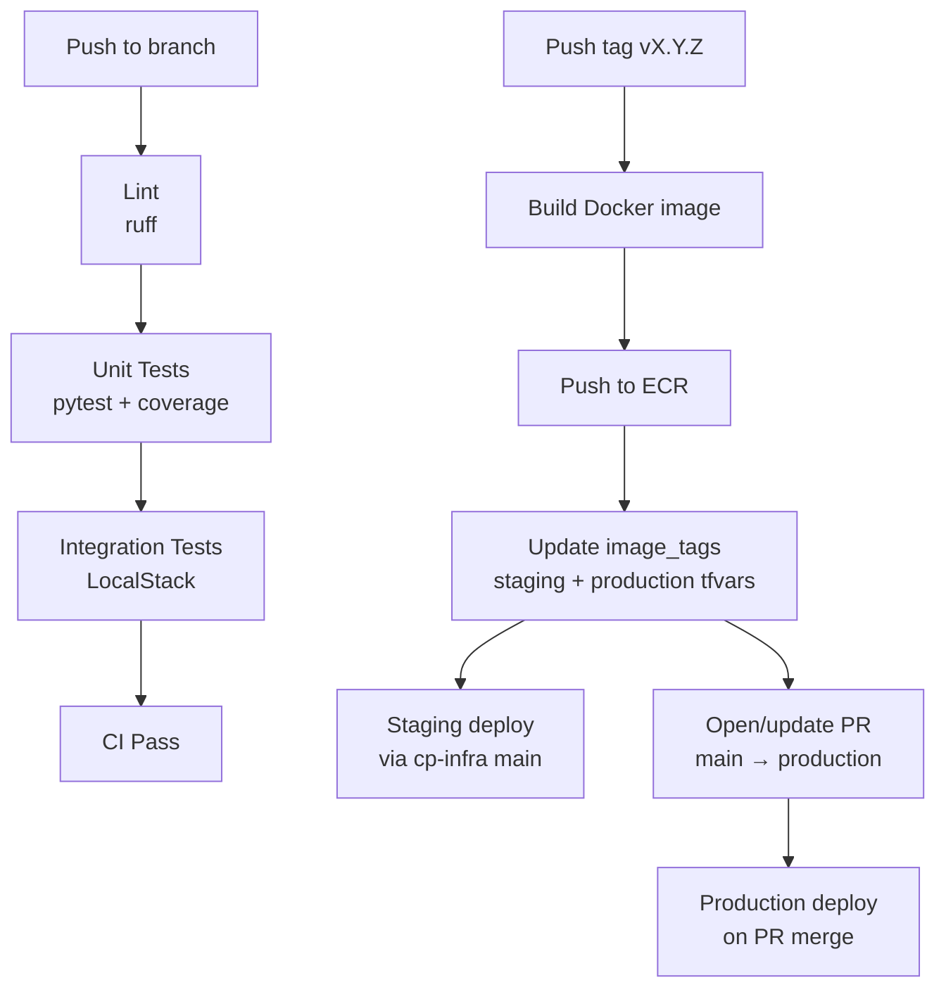

# cp-worker


SQS consumer microservice — polls an SQS queue on a configurable interval, uploads each message as a JSON object to S3, then deletes it from the queue.

---

## Architecture



---

## Message flow



---

## S3 key format

Messages are stored at:
```
messages/YYYY/MM/DD/<sqs-message-id>.json
```

Each file is enriched with processing metadata:
```json
{
  "message_id": "...",
  "email_subject": "...",
  "email_sender": "...",
  "email_timestream": "...",
  "email_content": "...",
  "_worker_metadata": {
    "processed_at": "2026-03-27T10:00:00+00:00",
    "s3_key": "messages/2026/03/27/<id>.json",
    "worker_version": "v1.0.2"
  }
}
```

---

## CI/CD



- **CI** runs on every push — lint, unit tests, integration tests against LocalStack
- **Release** triggers on `v*.*.*` tag push — builds image, pushes to ECR, updates `cp-infra` tfvars, opens production PR

---

## Local development

```bash
# Install dependencies
python -m venv .venv && source .venv/bin/activate
pip install -r requirements.txt -r requirements-dev.txt

# Run unit tests
make test-unit

# Run integration tests (requires LocalStack)
cd ../cp-infra && make local-up
LOCALSTACK_ENDPOINT=http://localhost:4566 make test-integration

# Run the worker locally
python -m app.worker
```

---

## Environment variables

| Variable | Default | Description |
|----------|---------|-------------|
| `AWS_REGION` | `us-east-2` | AWS region |
| `SQS_QUEUE_URL` | — | SQS queue URL to poll |
| `S3_BUCKET_NAME` | — | S3 bucket to upload messages to |
| `POLL_INTERVAL` | `5` | Seconds to sleep when queue is empty |
| `MAX_MESSAGES_PER_POLL` | `10` | Max messages per ReceiveMessage call |
| `SQS_VISIBILITY_TIMEOUT` | `30` | Seconds message is hidden after receive |
| `SQS_WAIT_TIME_SECONDS` | `20` | Long-polling wait time |
| `LOCALSTACK_ENDPOINT` | — | Set to use LocalStack instead of AWS |
| `LOG_LEVEL` | `INFO` | Log level |
| `APP_VERSION` | `unknown` | Injected at build time via `--build-arg VERSION` |

---

## Deploying a specific tag

```bash
# Trigger release workflow for an existing tag
gh workflow run release.yml \
  --repo koss110/cp-worker \
  --field image_tag=v1.0.2 \
  --field open_pr=true
```
